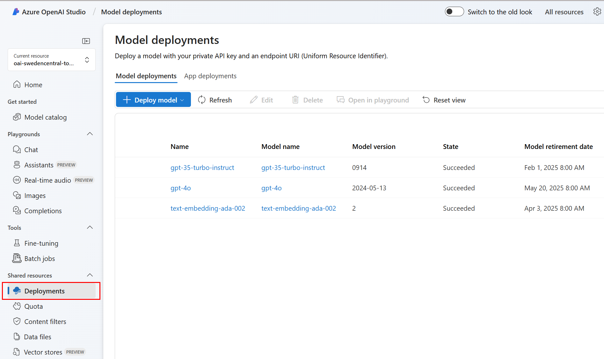

# 關於本 Python Notebook 

內容是修改自 https://github.com/Azure/azure-openai-samples/tree/main/quick_start ，旨在協助台灣開發人員快速了解 Azure OpenAI Service 基本開發概念

## 環境準備

- 備妥 Microsoft Azure 訂閱帳號
- 已經申請核准建立妥 Azure OpenAI Service 資源
- 已經於 Azure AI Studio 內建立好以下模型之部署 (deployment)
    + text-embedding-ada-002
    + gpt-35-turbo-instruct
    + gpt-4o

- 備妥 Python 3.11 與 Jupyter Notebook 相容之編輯執行環境

所需的三種模型，可點選下圖 [Azure AI Studio](https://oai.azure.com/portal) 標示之 **Deployments** 選項，即可依序建立部署，請紀錄模型之部署名稱，後續需要輸入環境變數之中。




## 設定作業系統之環境變數
當建妥 Azure OPENAI Service，透過 Azure Portal 取得呼叫所需的 API 鍵值與呼叫端點，設定以下數個環境變數
- **AZURE_OPENAI_ENDPOINT** Azure OpenAI Service 呼叫端點之環境變數
- **AZURE_OPENAI_API_KEY**  Azure OpenAI Service 之 API 鍵值之環境變數
- **AZURE_OPENAI_API_VERSION** Azure OpenAI Service 的 OpenAI API 版本之環境變數
- **CHAT_DEPLOYMENT_NAME**  能夠支援 Chat Completions API 的對話式語言模型部署名稱之環境變數
- **COMPLETIONS_DEPLOYMENT_NAME** 能夠支援 Completions API 的語言模型之環境變數
- **EMBEDDINS_DEPLOYMENT_NAME** 能夠支援 Embeddings API 的語言模型之環境變數

點選下圖 Azure Portal 標示選項可以取得 Azure OpenAI Service 呼叫端點與 API 鍵值。


若不想透過環境變數設定，則可直接修改本 Notebook 中的程式碼，例如:

 ```python
API_KEY = os.getenv('AZURE_OPENAI_API_KEY','1234567890abcdef1234567890abcdef')
RESOURCE_ENDPOINT = os.getenv('AZURE_OPENAI_ENDPOINT','https://<您的 Azure OpenAI 資源名稱>.openai.azure.com/')
MODEL = os.getenv('CHAT_DEPLOYMENT_NAME','gpt-4o')
openai.api_version = os.getenv('AZURE_OPENAI_API_VERSION','2023-05-15')
```

本範例採用了 Python dotenv 套件，環境變數也可以寫在 .env 檔案中，例如:

```bash
AZURE_OPENAI_ENDPOINT=https://<您的 Azure OpenAI 資源名稱>.openai.azure.com/
AZURE_OPENAI_API_KEY=1234567890abcdef1234567890abcdef
AZURE_OPENAI_API_VERSION=2023-05-15
CHAT_DEPLOYMENT_NAME=gpt-4o
COMPLETIONS_DEPLOYMENT_NAME=gpt-35-turbo-instruct
EMBEDDINS_DEPLOYMENT_NAME=text-embedding-ada-002
```
## 逐一執行本 Notebook 中的程式碼